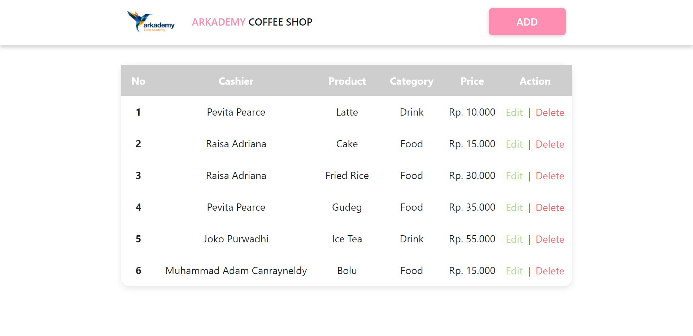
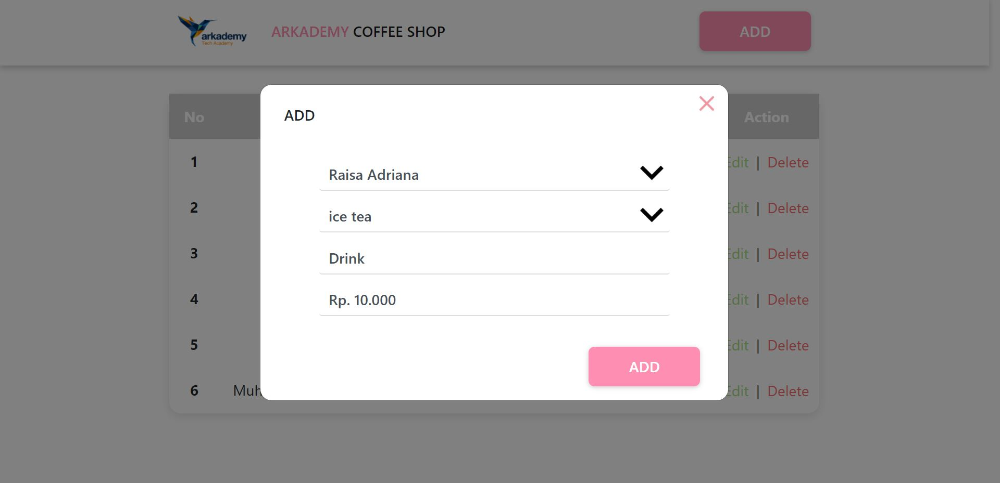
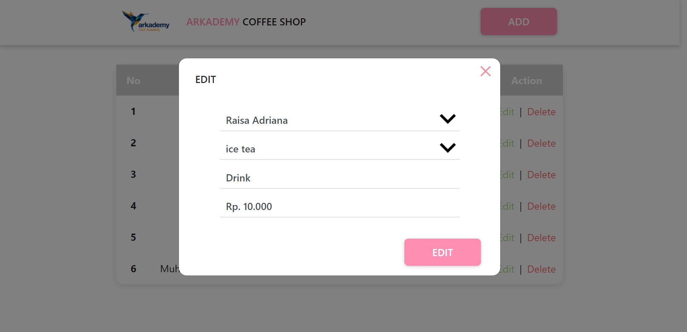
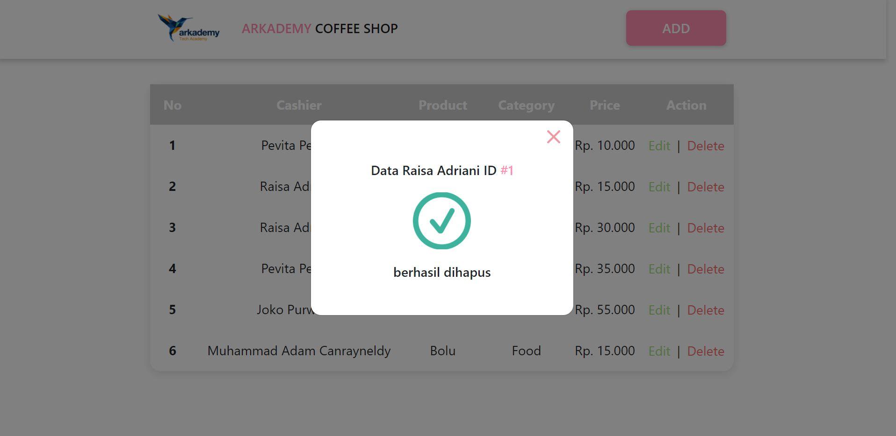

## Arkademy Batch 13 - 4
#### jawaban dari tes yang diberikan oleh Arkademy

Untuk soal **1** sampai **5** cara menjalakan:
* jalankan pada console di browser
* atau salin code-nya lalu jalankan(run) diconsole pada website berikut: [es6console.com](https://es6console.com/)

### Soal 1(1.js)
Pada 1.js terdapat sebuah function bernama **biodata** yang menerima dua buah parameter yaitu: **name(String)** dan **age(Int)**. function ini akan me-return biodata asli saja dalam bentuk **JSON**.

### Soal 2(2.js)
pada 2.js terdapat sebuah function bernama **validationForm** yang menerima dua buah parameter yaitu: **username(String)** dan **password(String)**. function ini akan memvalidasi **username** dan **password** untuk memutuskan username atau password itu valid atau tidak.

### Soal 3(3.js)
pada 3.js terdapat sebuah function bernama **cek_kata** yang menerima sebuah parameter yaitu: **string(String)**. function ini akan mengecek apakah benar yang diterima parameter itu adalah **String**. function ini akan mengembalikan ada berapa kata **String** yang terdapat pada suatu kalimat(misal: **3/4**).

### Soal 4(4.js)
pada 4.js terdapat sebuah function bernama **findPair** yang menerima sebuah parameter yaitu: **Array**. function ini akan mengecek apakah benar yang diterima parameter itu adalah **Array**. function ini akan mengembalikan ada berapa ada berapa pasangan bilangan yang ditemukan dalam **Array**.

### Soal 5(5.js)
pada 5.js terdapat sebuah function yang menerima sebuah parameter berupa **number(Int)**. function ini akan mengecek jika yang diterima oleh parameter itu bukan number. function ini akan membuat sebuah segitiga rata kanan pada konsole dan parameter yang diterima oleh function adlaah banyak **baris** dari segitiga tersebut.

### Soal 6(6.js)

yang harus disiapkan untuk menjalankan **soal 6**:
* Install Web Server(Xampp,Lamp,Mamp, dll) karena soal-6 membutuhkan web server dan database server.
* disini menggunakan **Xampp**
* clone/download repository **ArkademyBatch13-4** simpan di direktori Web Server, contoh: **xampp (C:/xampp/htdocs/)**

**Soal 6a**  
pada folder 6a terdapat file **arkademy_batch_13_4.sql** dan **Query.txt** untuk memunculkan tabel(perintah di soal 6a) dari hasil query.

cara menjalankan soal 6a:
* buka aplikasi XAMPP
* arahkan browser ke url **localhost/phpmyadmin**
* lalu buat database dengan nama **arkademy_batch_13_2**
* pilih database tersebut
* setelah itu pergi ke menu **Import**
* klik **pilih file**, lalu arahkan ke file **arkademy_batch_13_4.sql** pada folder **6a/**
* jika sudah klik **go**
* maka database tadi sudah berisi tabel yang diimport tadi
* setelah itu masuk ke database tersebut dan klik menu **SQL**
* dan paste-kan **Query** yang ada pada file **Query.txt**
* lalu klik **go**, maka tampilannya akan sesuai dengan yang diminta oleh soal.

**Soal 6b**  
cara menjalankan soal 6b:
* hanya jalankan **index.html** pada browser
* karena masih menggunakan data statis

**Soal 6c**  
Struktur folder 6c:
* **assets/**  
folder ini menyimpan semua bahan yang diperlukan seperti: **CSS**, **Gambar**, **Javascript**, dll.
  * **css/** -- pada folder ini terdapat file-file css yang diperlukan termasuk bootstrap.
  * **img/** -- pada folder ini terdapat semua gambar, icon ataupun logo yang kita perlukan.
  * **js/** pada folder ini terdapat javascript yang kita perlukan untuk website termasuk Jquery.
* **functions.php** -- file ini merupakan jembatan antara **Website** dengan **Database**.
* **hapus.php** -- file ini untuk memproses Query **DELETE** pada sebuah tabel didatabase.
* **index.php** -- ini adalah halam index/utama yang akan ditampilkan ke user.

cara menjalankan soal 6c:
* buka aplikasi XAMPP
* arahkan browser ke url **localhost/ArkademyBatch13-4/soal-6/6c/index.php**
* jika berhasil maka tampilannya akan seperti pada **Demo Aplikasi dibawah ini.**

**Demo Aplikasi**

Tampilan utama:

 
 
Tampilan ketika button **ADD** ditekan:

 
 
Tampilan ketika button **Edit** ditekan:

 
 
Tampilan ketika button **Delete** ditekan:

 

